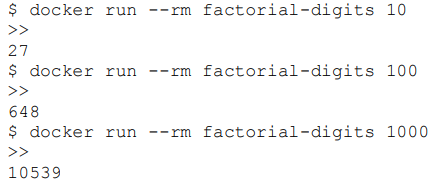
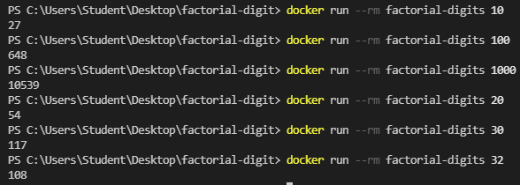

# Corigine Technical Assignment
## Description

This assignment solves an algorithmic problem, where the factorial is found of the input and each digit of the factorial digit is added to give a final value.

## Requirements

* Use Python 3.
* Use numpy for any math operations.
* Avoid casting variables if possible.
* Follow good programming practices
* The code must be packaged and executed as a docker container

## Sample Output

## Software Description

-  Docker Desktop 
- Visual Studio Code

- Extensions used in Visual Studio code
    - Python
    - Docker
    - Remote - WSL

## File Structure

* Images
    * Results.PNG
    * SampleOutput.PNG
* Dockerfile
* factorial-digits.py
* README.md
* Shivasen.tar.gz

## Program Description
### factorial-digits.py

This python script contains the context for the docker container. The program uses the library 'numpy', 'fractions' and 'sys'. The code first takes an input using 'sys.argv'. The function 'eval' is used as it takes the input as an expression and returns it as an integer. A try and except is used to determine whether the user as entered in only numbers or letters into the command line. If letters are entered, the program will print 'Enter a number!' and exit the program. There is also an 'if' statement which checks if the number is negative. If the number is negative, the program will print 'Enter a positive number!' and exit the program. Thereafter, the factorial of the digit is found using the numpy library. 

The function 'SumOfFactorial' is called which determines the sum of each digit of the factorial. A 'while' statement is done to continuously obtain each digit and add it to the final value until the number is below 10. A modulus of 10 is done on the number to obtain the last digit of the number using the 'numpy.remainder' function. Then the digit is divided using the 'numpy.floor_divide' function. To keep the precision of the divided value, the fractions library is used. The value from the modulus is then added to the final value variable. When the number is less than 10, it is added straight to the final value variable and the end result is printed to the console (which is the sum of the factorial digits). Thereafter, a break statement is used to exit the while loop.

### Dockerfile

This file contains code which is used to build the docker image which is used to run a docker container. The code first uses the FROM command which is used for the base image of the build. The base image used is python 3.8-slim (although it works with 'python:3' which was tested). Thereafter, WORKDIR is called which sets a working directory for the instructions that follow it. The command RUN is called which is used to install the numpy library since that is not able on the python package (the command used is 'pip install numpy'). The COPY command is used to copy and add the file to the file system of the image (the command ADD can also be used). The command ENTRYPOINT is used, this uses the python script as the entry point so any arguments that are passed in the docker run command will be added at the entry point (which is factorial-digits.py). Thereafter, the command CMD is used which sets the default command; so if no argument is passed with the docker run command, the default value used is 10. 

## Docker commands

Build command:

* docker build -t factorial-digits .

Run commands:

* docker run --rm factorial-digits 10
* docker run --rm factorial-digits 100
* docker run --rm factorial-digits 1000

To further test program:

* docker run --rm factorial-digits 20
* docker run --rm factorial-digits 30
* docker run --rm factorial-digits 32

To keep the container after executing the 'docker run' command, use:

* docker run factorial-digits 10
* docker run factorial-digits 100
* docker run factorial-digits 1000

## Results

## Debugging

The 'floor_divide' function from the numpy library where used although it returned the values as a float so it decreases the precision of the number and results in the wrong final answer. When looking at each printed value in the while loop, it showed that some values where converted into 'numpy.float64' which resulted in the values being represented in scientific notation causing a loss of precision. To solve this, the 'fraction' library was used on the division function to maintain the precision.

## References

* [NumPy library](https://numpy.org/doc/stable/index.html)
* [Fraction library](https://docs.python.org/3/library/fractions.html)